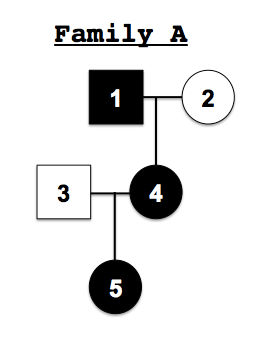

Loading Data
============

This page describes how data is loaded into xBrowse.
For more background on how data is organized internally, see <a href="data-organization">data organization</a>.
Currently there is no automated upload process - all data must be loaded by hand by the ATGU staff.
It's a simple process, you just have to email us the necessary input files and we run a quick script.
An automatic upload feature is on the product roadmap.

## Step 1: Sample Data

We've adopted the convention of loading all sample and phenotype data into xBrowse before variant data (VCF) is loaded.
This helps us stay organized and enables an important class of QC -
that your genotype data is actually what you are expecting.

Sample data can be sent in a variety of optional tab-delimited text files; these are described below.

### PED files

If you are uploading any families into xBrowse (as opposed to cohorts of isolated probands)
you must specify the relationships in a PED file.
The PED file format is described in detail on the
[PLINK website](http://pngu.mgh.harvard.edu/~purcell/plink/data.shtml#long).

A quick primer: PED files have one line per individual with the following fields:

    FAMILY_ID   INDIVIDUAL_ID   PATERNAL_ID MATERNAL_ID GENDER  AFFECTED_STATUS

Some notes that are specific to xBrowse:

- All of the *_ID fields must be "slugs" - a combination of letters, numbers, `_` and `-`.
Periods are not allowed in any of the ID fields.

- `INDIVIDUAL_ID` should be *exactly* the ID in a VCF file, and is case sensitive.

- Any of the final four fields can be set to `.` or `0` if unknown

- Only specify `MATERNAL_ID` or `PATERNAL_ID` if there is in fact genotype data on this individual.
If not, leave it as `.`.
This is not ideal, and was poor design on Brett's part when we first built xBrowse.
It means that two siblings are stored the same way as two affected cousins.
We are exploring a fix for this.

- The `GENDER` is coded as `2` -> Female; `1` -> Male; `.` -> Unknown

- The `AFFECTED_STATUS` is coded as `2` -> Affected; `1` -> Unaffected; `.` -> Unknown

As an example, consider the following pedigree:

This pedigree would be encoded in a PED file as follows:

    FAMILY_ID INDIVIDUAL_ID PATERNAL_ID MATERNAL_ID GENDER AFFECTED_STATUS
    A         1             .           .           1      2
    A         2             .           .           2      1
    A         4             1           2           2      2
    A         3             .           .           1      1
    A         5             3           4           2      2

### Sample List Files

The PED files above only make sense if you are actually loading families.
If you are loading cohorts, you can load sample data from a *sample list file* instead,
which is just a PED file with only the `INDIVIDUAL_ID` column: a text file with a list of IDs, one per line.
Like PED files, this ID must match the VCF file exactly.

### Nickname Files

We mention above that INDIVIDUAL_ID must be the exact ID in a VCF file.
Working with these identifiers can get frustrating sometimes;
you can optionally assign a more human readable *nickname* to samples if you prefer.

Nicknames are specified in a *nickname file*, with the following fields:

    INDIVIDUAL_ID   NICKNAME

`INDIVIDUAL_ID` must match the PED file exactly. `NICKNAME` can have spaces and punctuation.

## Other Phenotype Data

xBrowse also allows you to store other clinical metadata about samples:

- Pedigree diagrams

- Clinical details in free form text

- Short summary descriptions of individuals and families

- Phenotype categorizations beyond case/control status.

These are all configurable in the xBrowse web interface, but that can be time consuming for large projects.
If you want to upload any of these data in bulk, send us flat files by email.

## Step 2: Variant Data

The main input to xBrowse is <a href="www.1000genomes.org/wiki/Analysis/Variant Call Format/vcf-variant-call-format-version-41">VCF files</a>.
VCFs are assumed to be produced by the GATK,
though data from some other variant calling pipelines can sometimes be used, too.

**Note**: We are working on adding an optional BAM file input as well,
which will allow you to view raw read data alongside variant calls, but this isn't finished yet.

VCF files are often too big to email, you can send us VCF files in any way you prefer.
One restriction is that all the exome data for a family must be in the same VCF file,
so if you split your VCFs by chromosome you might have to rn `vcf-merge` first.

We strongly encourage to keep all of the data in an xBrowse project in one VCF file.
Errors can arise while combining callsets, and it's usually better to identify them quickly and "fail fast".